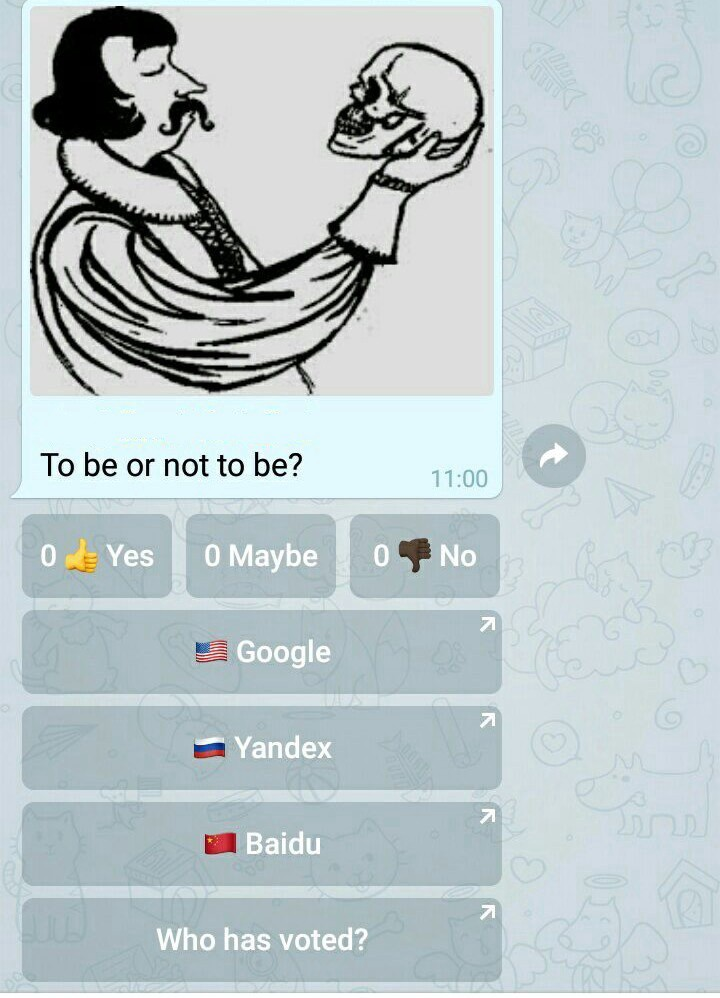

# Voting buttons and link buttons in EmailGateBot

EmailGateBot can also be used to create polls with buttons, that have location, titles, and emotions as you need.
Messages in Telegram, that were sent via an EmailGateBot, can contain any combination of inline buttons with emoji icons.
If you put special string `###buttons` in the email text body, the tail of the email after this sign will be interpreted as inline buttons definition.

The text inside square brackets defines the inline button as the poll option.
You can put several definitions, separated by spaces, in one row.

```
###buttons
[Yes] [No]
```

The text of buttons title can contain codes, that displaying as emoji icons.
A complete list of emoji codes can be [found here](http://www.unicode.org/emoji/charts/full-emoji-list.html)
or use the bot command `/emojicode` to get the code for the desired icon.

If a closed square bracket is followed by an open round bracket (with no spaces), then this button definition is interpreted as the url-link button.
Url address must be put inside round brackets.



And all of this can be mixed in any combination.
For example, to create the poll shown in the picture above, the body of the email should be:

```
To be or not to be?
###buttons en
[{0001F44D} Yes] [Maybe] [{0001F44E}{0001F3FF} No]
[{0001F1EC}{0001F1E7} Google](https://google.com)
[{0001F1F7}{0001F1FA} Yandex](https://ya.ru)
[{0001F1E8}{0001F1F3} Baidu](http://www.baidu.com)
```

And the corresponding picture should be attached to the email.

By default, the poll will be active for 30 days from the date of creation.
This is the maximum duration of the poll.
You can reduce it by setting the duration of the poll in minutes.
For example, for a 10-minute poll:

```
###buttons 10
```

- Go to [@EmailGateBot](http://t.me/EmailGateBot?start=utm_KDaxQG000_github-en-buttons)
- Return [to TOC](guide.md)
- Next: [Viewing the list of voters](view_voters.md)
