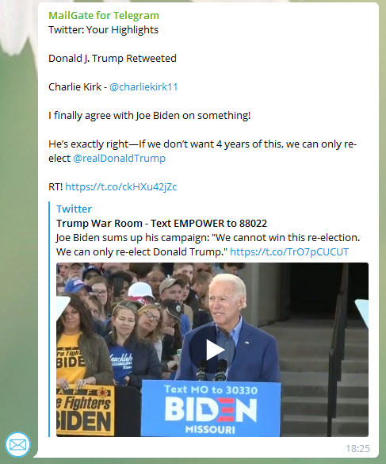

# Notifications in Telegram Messenger channels and groups from popular resources: Facebook, Twitter, Reddit, etc. Open-source solution.

You can receive notifications in Telegram from any resource that can send notifications to the email you specify.
To do this, you need:

- make sure that you have enabled notifications on your mailbox on this resource
- get a special email address from the Telegram EmailGateBot bot
- enable forwarding notifications to this email in your inbox

To remove HTML markup from forwarded messages and make messages concise and informative, EmailGateBot uses its [automatic text conversion feature](text_conversion.md).
EmailGateBot sends the contents of the received notifications to a special site and publishes a response from this site in the desired channel/group.

In this way, EmailGateBot can handle notifications from Twitter, YouTube, Reddit, and some other sites.
EmailGateBot determines resources by the address of sender.
For example, notifications from Facebook are sent from `notification@facebookmail.com`.

The code for the site that processes the contents of notifications is written in Python/Flask and is
[available at Github](https://github.com/vb64/telegram.email.notify).
You can freely use this code to deploy your own notification processing site on your host.
Or offer code ([Pull Request on Github](https://docs.github.com/en/github/collaborating-with-issues-and-pull-requests/creating-a-pull-request)),
which will process the notifications you need on the existing EmailGateBot host.

In addition to publishing notifications from popular resources, EmailGateBot can do a lot of useful things.
You can read a [detailed description](guide.md) of the features of EmailGateBot.

Go to [@EmailGateBot](http://t.me/EmailGateBot?start=utm_KDaxQG000_github-en-transform)
