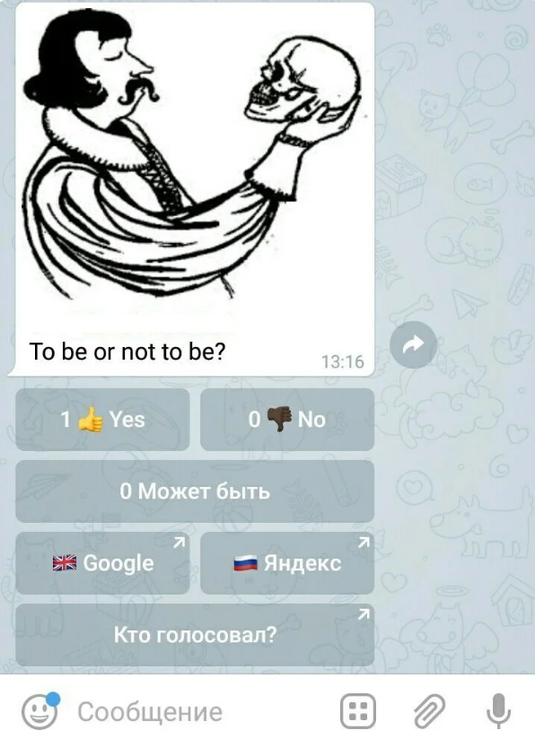

# Кнопки голосования и кнопки-ссылки в EmailGateBot

Сообщения в Telegram, которые были отправлены через EmailGateBot, могут содержать любую комбинацию встроенных кнопок с иконками эмодзи.
Если вы поместите в текст письма специальную строку `###buttons`, то остаток письма после этой строки будет интерпретирован как определение встроенных кнопок.

Текст внутри квадратных скобок создает встроенную кнопку голосования в опросе.
Вы можете задать несколько таких определений в одной строке.

```
###buttons
[Да] [Нет]
```

Текст в заголовке кнопки может содержать коды, отображаемые как значки эмодзи.
Полный список кодов эмодзи можно [посмотреть тут](http://www.unicode.org/emoji/charts/full-emoji-list.html)
или воспользоваться командой `/emojicode` бота для получения кода нужного значка.

Если после закрывающей квадратной скобки сразу (без пробелов) следует открывающая круглая скобка,
то такое определение кнопки интерпретируется как кнопка с url-ссылкой.
Адрес url должен находиться внутри круглых скобок.



И все это можно смешивать в произвольных комбинациях.
Например, чтобы создать опрос, показанный на картинке выше, тело письма должно быть таким:

```
To be or not to be?
###buttons ru
[{0001F44D} Yes] [{0001F44E}{0001F3FF} No]
[Может быть]
[{0001F1EC}{0001F1E7} Google](https://google.com)
[{0001F1F7}{0001F1FA} Яндекс](https://ya.ru)
```

И соответствующая картинка должна быть прикреплена к письму.

По умолчанию опрос будет активен 30 дней с момента создания.
Это максимальное значение длительности опроса.
Вы можете его уменьшить, задав продолжительность опроса в минутах в строке с `###buttons`.
Например, для 10-минутного опроса:

```
###buttons 10
```

Для неактивных опросов кнопки и результаты голосования отображаются по прежнему, но нажатия на кнопки не засчитывается в результаты голосования.

- Перейти в [@EmailGateBot](http://t.me/EmailGateBot?start=utm_KDaxQG000_github-ru-buttons)
- Вернуться [к оглавлению](guide.md)
- Далее: [Просмотр списка голосовавших](view_voters.md)
