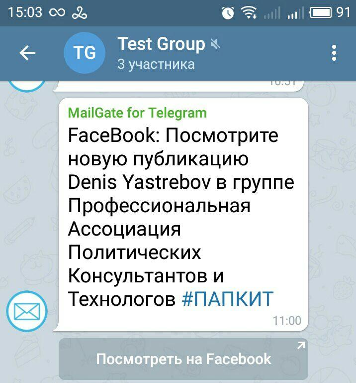

# Оповещения в группах и каналах Telegram о новых публикациях в FaceBook

Вы можете получать оповещения в группах и каналах мессенджера Telegram о новых публикациях в FaceBook. Для этого необходимо:

- убедиться, что вы подписаны на соответствующую группу/аккаунт и включили оповещения на электронную почту
- получить у бота Telegram @EmailGateBot специальный адрес емейл.
- включить в вашем почтовом ящике пересылку сообщений от FaceBook на этот емейл

В Telegram начните диалог с ботом EmailGateBot и отправьте ему команду `/start`. В меню выберите чат, в котором вы хотите получать оповещения о новых видео.
Если вы впервые используете @EmailGateBot, то в списке будет единственный пункт - приватный чат с ботом ("Этот чат").

Сохраните адрес email, который вам сообщит бот.

FaceBook рассылает оповещения с адреса `notification@facebookmail.com`.
Если вы используете почту Mail.Ru, то прочитайте [инструкцию как настроить фильтр для пересылки писем из Mail.Ru](https://help.mail.ru/mail/settings/filters/create) с адреса notification@facebookmail.com на адрес, полученный у EmailGateBot.
При настройке пересылки Mail.Ru с адреса вида `forward-xxx.xxx-CODE@forward.mail.ru` отправит на указанный вами в созданном правиле емейл запрос на подтверждение пересылки. В приватном чате с EmailGateBot в Telegram вы увидите примерно такое сообщение.

Кодом подтверждения будет часть адреса почтового ящика перед символом '@'. В приведенном примере это 'z9gz3klk'. Скопируйте код подтверждения и введите его на Mail.Ru.

Сообщения от forward-48252064.16537863-z9gz3klk@forward.mail.ru нам не нужно, поэтому в EmailGateBot в меню выберите пункт "Запретить в этот раз".

Пересылка настроена, осталось дождаться первого оповещения от FaceBook с адреса `notification@facebookmail.com` и "Разрешить навсегда" оповещения с этого адреса.
Следующие оповещения также будут появляться в Telegram. Если вы захотите отключить эти оповещения, отключите или удалите правило обработки входящей почты, которое пересылает оповещения на полученный у EmailGateBot емейл.

Кроме показа оповещений новых публикациях в FaceBook, EmailGateBot умеет делать много полезных вещей. Можете ознакомиться с [подробным описанием](../guide.md) возможностей EmailGateBot.
