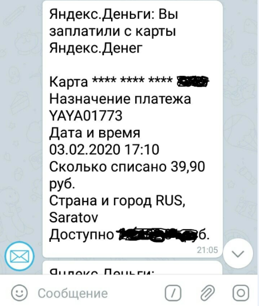

# Оповещения в каналах и группах Telegram от популярных ресурсов: ЯндексДеньги, Facebook, Одноклассники и т.п. Решение с открытым исходным кодом.

Вы можете получать в Telegram оповещения от любого ресурса, который может отправлять оповещения на заданный вами email. Для этого нужно:

- убедиться, что на этом ресурсе вы включили оповещения на ваш почтовый ящик
- получить у бота Telegram EmailGateBot специальный адрес емейл
- включить в вашем почтовом ящике пересылку оповещений на этот емейл

Чтобы убрать из пересылаемых сообщений HTML разметку и сделать сообщения краткими и информативными, EmailGateBot использует свою [функцию автоматического преобразования текста](text_conversion.md).
EmailGateBot отправляет содержимое получаемых оповещений на специальный сайт и публикует в нужном канале/группе Telegram ответ от этого сайта.

Таким способом EmailGateBot может обрабатывать оповещения от [FaceBook](fb/guide.md), Одноклассники, [Яндекс Деньги](ym/guide.md), голосовой почты Билайн и некоторых других.
От какого именно ресурса поступило оповещение, EmailGateBot определяет по адресу отправителя.
Например, оповещения от ЯндексДеньги рассылаются с адреса `inform@yamoney.ru`.

Код сайта, который обрабатывает содержимое оповещений, написан на Python/Flask и [доступен на Github](https://github.com/vb64/telegram.email.notify/blob/master/README-ru.md).
Вы можете свободно использовать данный код, чтобы развернуть собственный сайт обработки оповещений на своем хосте.
Или предложить свой код ([Pull Request на Github](https://habr.com/ru/post/125999/)), который будет обрабатывать нужные вам оповещения на существующем хосте EmailGateBot.

Кроме показа оповещений от популярных ресурсов, @EmailGateBot умеет делать много полезных вещей.
Можете ознакомиться с [подробным описанием](guide.md) возможностей EmailGateBot.

Перейти в [@EmailGateBot](http://t.me/EmailGateBot?start=utm_KDaxQG000_github-ru-transform)
