## Оповещения в Telegram об операциях пользователей Яндекс Денег

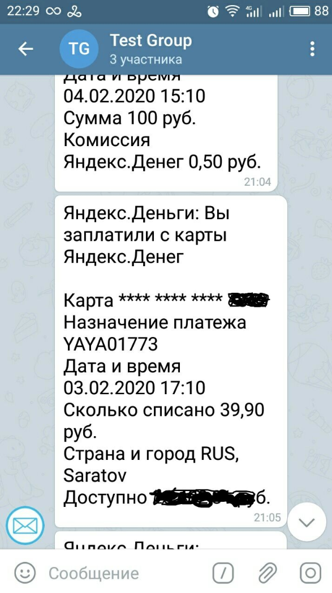

Вы можете получать оповещения о ваших операциях с яндекс деньгами в мессенджере Telegram. Для этого необходимо:

- убедиться, что в вашем кошельке Яндекс Денег включены оповещения на электронную почту
- получить у бота Telegram @EmailGateBot специальный адрес емейл.
- включить в вашем почтовом ящике пересылку сообщений от Яндекс Денег на этот емейл

На [странице настроек вашего кошелька Яндекс Денег](https://money.yandex.ru/settings) перейдите на вкладку "Информирование" и убедитесь, что в пункте "Письма", "Информирование об операциях" включено оповещение на вашу электронную почту.

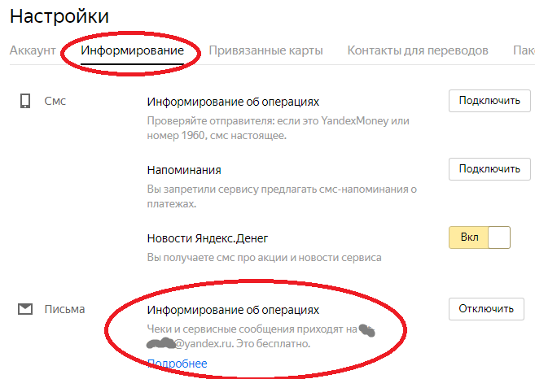

В Telegram начните диалог с ботом EmailGateBot и отправьте ему команду `/start`. В меню выберите чат, в котором вы хотите получать оповещения об операциях с Яндекс Деньгами.
Если вы впервые используете EmailGateBot, то в списке будет единственный пункт - приватный чат с ботом ("Этот чат").

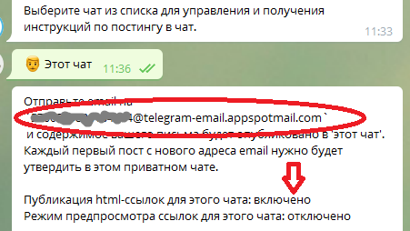

Сохраните адрес email, который вам сообщит бот. Также убедитесь, что для чата включена публикация html-ссылок. Включить ее можно, выбрав в боте пункт "Html-ссылки" в меню чата.

Затем перейдите на страницу настроек своего почтового ящика, куда Яндекс Деньги посылают оповещения об операциях. В данном примере предполагается, что вы используете почту Яндекса.

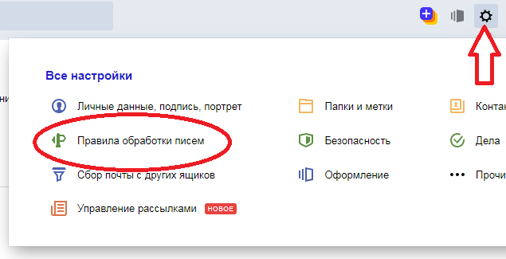

Создайте новое правило обработки входящей почты.

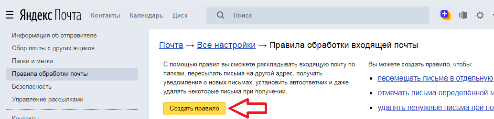

Яндекс Деньги рассылают оповещения с адреса `inform@money.yandex.ru`. Укажите этот адрес в поле "От кого", "содержит" создаваемого правила. В поле "Переслать по адресу" укажите емейл, полученный у EmailGateBot и сохраните правило.

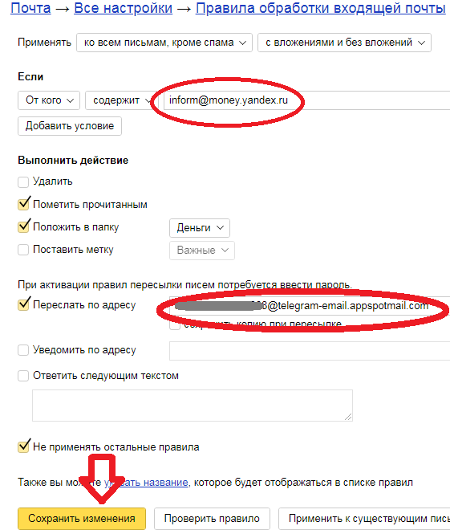

Яндекс Почта с адреса `devnull@yandex.ru` отправит на указанный вами в созданном правиле емейл запрос на подтверждение пересылки. В приватном чате с EmailGateBot в Telegram вы увидите примерно такое сообщение.

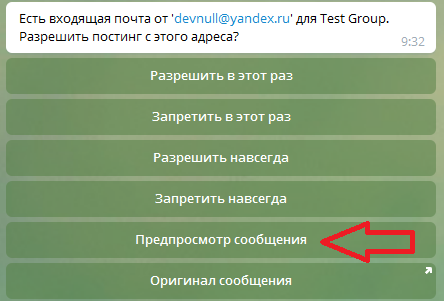

В меню выберите пункт "Предпросмотр сообщения". EmailGateBot покажет текст запроса на подтверждение пересылки. Перейдите по ссылке из запроса, чтобы подтвердить пересылку.
Включение публикация html-ссылок в боте, которое мы сделали ранее, было нужно чтобы увидеть данную ссылку.

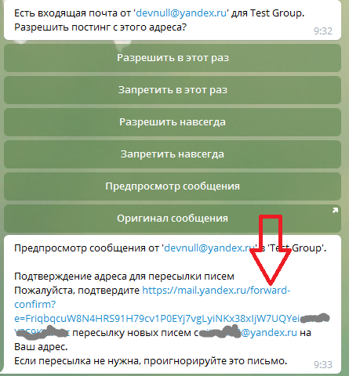

После подтверждения пересылки созданное правило в Яндекс Почте станет активным - в списке правил его переключатель будет окрашен в зеленый цвет.

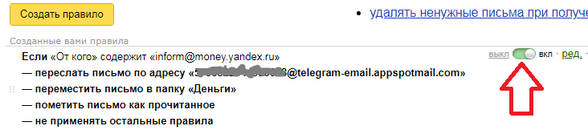

Сообщения от `devnull@yandex.ru` нам не нужно, поэтому в EmailGateBot в меню выберите пункт "Запретить в этот раз".

Пересылка настроена, осталось сделать какую-нибудь операцию в Яндекс Деньги, чтобы получить оповещение об этой операции в Telegram.

Хорошим способом проверки настроенных оповещений будет отправить небольшое пожертвование из Яндекс Денег автору EmailGateBot :)

Отправьте в приватный чат EmailGateBot команду `/donate` и нажмите кнопку "Поддержать проект". Из предложенных способов оплаты выберите Яндекс Деньги и переведите сумму по вашему усмотрению.
В приватный чат EmailGateBot поступит примерно такое сообщение.

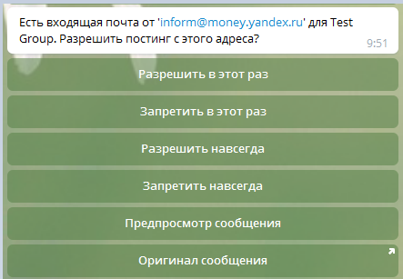

Выберите пункт меню "Разрешить навсегда" и в выбранном вами чате Telegram появится оповещение о вашей операции в Яндекс Деньгах.

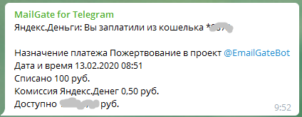

Оповещения о всех следующих операциях также будут появляться в Telegram. Если вы захотите отключить эти оповещения, отключите или удалите правило обработки входящей почты, которое пересылает оповещения на полученный у EmailGateBot емейл.

Кроме показа оповещений об операциях в Яндекс Деньгах, EmailGateBot умеет делать много полезных вещей. Можете ознакомиться с [подробным описанием](../guide.md) возможностей EmailGateBot.
