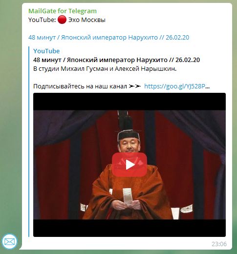
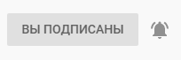
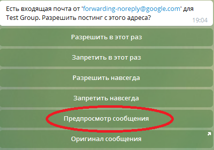
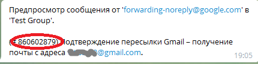

## Оповещения в Telegram о новых видео на YouTube

Вы можете получать оповещения в мессенджере Telegram о появлении новых видео на YouTube. Для этого необходимо:

- убедиться, что вы подписаны на соответствующий канал и прожали там колокольчик
- получить у бота Telegram @EmailGateBot специальный адрес емейл
- включить в вашем почтовом ящике пересылку сообщений от YouTube на этот емейл

Убедитесь, что вы подписаны на канал, откуда хотите получать оповещения о новых видео и прожали там колокольчик (включили оповещения на свою электронную почту).
Полностью настроить оповещения от YouTube можно на [странице настроек уведомлений YouTube](https://www.youtube.com/account_notifications)

В Telegram начните диалог с ботом EmailGateBot и отправьте ему команду `/start`. В меню выберите чат, в котором вы хотите получать оповещения о новых видео.
Если вы впервые используете EmailGateBot, то в списке будет единственный пункт - приватный чат с ботом ("Этот чат").

Сохраните адрес email, который вам сообщит бот. Также убедитесь, что для чата включена публикация html-ссылок. Включить ее можно, выбрав в боте пункт "Html-ссылки" в меню чата.

YouTube рассылает оповещения с адреса `noreply@youtube.com`.
Если вы используете почту Gmail, то прочитайте [инструкцию как настроить автоматическую пересылку писем из Gmail](https://support.google.com/mail/answer/10957?hl=ru) с адреса noreply@youtube.com на адрес, полученный у EmailGateBot.
При настройке пересылки Gmail с адреса `forwarding-noreply@google.com` отправит на указанный вами в созданном правиле емейл запрос на подтверждение пересылки. В приватном чате с EmailGateBot в Telegram вы увидите примерно такое сообщение.

В меню выберите пункт "Предпросмотр сообщения". EmailGateBot покажет текст запроса на подтверждение пересылки. Скопируйте код подтверждения и введите его в Gmail.

Сообщения от `forwarding-noreply@google.com` нам не нужно, поэтому в EmailGateBot в меню выберите пункт "Запретить в этот раз".

Пересылка настроена, осталось дождаться первого оповещения от YouTube с адреса `noreply@youtube.com` и "Разрешить навсегда" оповещения с этого адреса.
Следующие оповещения также будут появляться в Telegram. Если вы захотите отключить эти оповещения, отключите или удалите правило обработки входящей почты, которое пересылает оповещения на полученный у EmailGateBot емейл.

Кроме показа оповещений о новых видео на YouTube, EmailGateBot умеет делать много полезных вещей. Можете ознакомиться с [подробным описанием](../guide.md) возможностей EmailGateBot.
